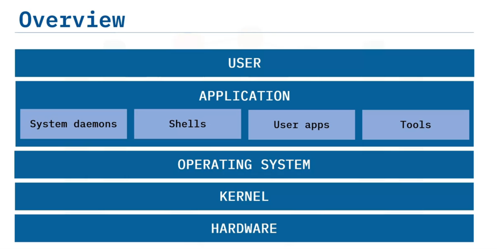

# Course Introduction

Welcome to this course about Linux commands and shell scripts. In this course, you will explore how to get started with using Linux and the most commonly used shell commands. You will recognize that a shell is a powerful user interface for Linux and Unix-like operating systems. It can interpret commands and run other programs. 

It also enables access and interactivity with files, utilities, and applications. Additionally, you will discover how to create shell scripts to automate tasks, run batch jobs, and quickly create useful programs. This course has three instructors: Ramesh Sannareddy, Rav Ahuja, and Sam Prokopchuk. Ramesh Sannareddy is a seasoned subject matter expert with Skill-Up Technologies. Rav Ahuja is a Global Program Director at IBM and the architect for several IBM Professional Certificates. And, Sam Prokopchuk is a data scientist and software developer at IBM. Now, learning Linux commands and shell scripting (Bash in particular) also makes you more flexible, whether you are a software developer, data scientist, data engineer, systems administrator, DevOps professional, system architect, or software engineer. Once you have a good understanding of Bash commands, it’s relatively easy to write scripts that simplify the building of all sorts of data pipelines and application workflows. In this course, you will learn all about the basics of Linux, the use of common Linux commands, and the basics of shell scripting with Bash. We will start off with an introduction to Linux. 

You will learn about the origins of Unix and Linux, the architecture of a Linux distro, and how to accomplish simple tasks in a Linux terminal. You’ll then explore commands for collecting user information, accessing variable values, and printing useful output to the terminal window. You will learn how to navigate your file system by listing your directories and their contents, determining where you are within your directory tree at any time, moving to other directories with ease, and quickly finding the files you need. You will also learn how to manage your files and directories by creating new directories, removing unwanted directories, creating new files, and copying and moving files and directories. 

You will learn how to view the contents of your files in various ways, for example, using the “cat” command and the “more” command. You will also discover how to get useful summary information about the contents of your files. You will also gain experience with creating customized views of your file contents, for example, by sorting the contents line by line, excluding repeated lines from the view, and extracting particular sections from each line. You will get hands-on experience with archiving the files and directories in a directory tree, extracting files and folders from your archives, and extracting and decompressing files from zipped archives. 

You will also gain skills by applying networking commands, for example, determining your host name, getting detailed information about your network configuration, and conveniently downloading files from the web. We’ll continue with an introduction to shell scripting. You will explore all aspects of scripts and Bash shell scripting, what shell scripting is used for, and how to create and run your own shell scripts. You will also gain valuable knowledge about filter commands and chaining your filters together using the pipe command. In addition, you will learn about defining shell variables and environment variables. 

You will discover useful features of the Bash shell along the way, including the use of metacharacters, input and output redirection, and passing arguments, specified on the command line, to your shell scripts. You will also discover how to put your shell scripts into production by learning all about the cron service for running jobs, scheduling your jobs with crontab, and viewing and editing the cron jobs currently running on your system. Finally, you will put your newly acquired skills to the test by completing a hands-on project that involves various Linux commands and building a shell script. To get the most from this course, watch every video and check your learning by taking the quizzes. Use the discussion forums to connect with your peers and the teaching assistants. And most importantly, make sure you complete the hands-on labs to practice your new skills and demonstrate your abilities. Congratulations on beginning the next step of this exciting journey. And good luck!

# Introduction to Linux

## Introducing Linux and Unix

Welcome to Introduction to Linux and Unix. After watching this video, you will be able to: Explain what an operating system, or OS, is Describe the origins of Linux and Unix. And list some of the features of Linux and Unix. What is an operating system? It is software that: Manages computer hardware and resources And allows interaction with hardware to perform useful tasks. So, what is Unix? It’s a family of operating systems Some popular Unix-based operating systems include: Oracle Solaris (and Open Solaris) FreeBSD HP-UX IBM AIX And Apple macOS, which is one of the most popular desktop operating systems today. 

In the 1960s, the original Unix OS was created at AT&T Bell Labs. However, like many operating systems at the time, it was made for a specific hardware system, in this case, the PDP-7 computer. In the 1970s, the Unix OS was rewritten in C [Programming Language], distinguishing itself from other systems and making it portable to many hardware architectures. And then in the late 1970s, UC Berkley developed Berkley Software Distribution (or BSD), an add-on to Unix providing additional software and capabilities. The famous macOS was later derived from BSD. So, what is Linux? Linux is a family of Unix-like operating systems. However, when referring to Linux, people are usually talking about a specific distribution or flavor. 

Linux was developed as an effort to create a free, open source version of the Unix OS. Key Linux features include the following: Linux is free and open source, which means anyone can view the source code. With so many eyes on the source code, Linux has become the most secure OS over the years. It’s multi-user. Linux is designed to support multiple users accessing the system simultaneously. It supports multitasking, running multiple jobs and applications at the same time And it’s portable. 

Linux has been ported to run on many different types of devices and hardware platforms from desktops to servers to appliances. How did Linux start? In the 1980s, GNU was developed at MIT. GNU stands for “GNU’s not Unix” and was made as a free, open source set of the existing Unix system tools. And in 1991, Linus Torvalds developed a free, open source version of the Unix kernel called Linux. The kernel is the core component of an OS that enables components to communicate with the machine’s hardware. Here is Linus Torvalds’ famous post where he shared his progress making his own open-source Unix-Like Kernel. He references minix, which was another Unix-like kernel at the time. Soon after, in 1992, the potential of unifying GNU and the Linux kernel was realized as popular Linux operating systems began to appear. And in 1996, a computer scientist named Larry Ewing created ”Tux” the penguin, which was later adopted by Linus Torvalds as the official Linux mascot. Today, the BSD-based macOS runs on millions of devices across the world. 

Billions of Linux instances run on servers, serving us the modern web. And especially among developers, modern Linux operating systems such as Ubuntu are beginning to gain popularity in the PC space. What are the most common use cases for Linux today? First, it’s used in billions of smartphones around the world via the Android operating system, which uses a Linux-based kernel. Linux is also widely used in supercomputers where many Linux-powered servers are clustered together for high-performance computing applications. Enterprise and cloud data centers also use Linux over millions of servers running all kinds of applications, web servers, databases, and so on. 

And finally, versions of Linux can be easily used as your PC’s operating system. Many people install Linux today as a learning experience or as their daily driver. In this video, you learned that: Unix is a family of operating systems dating from the 1960s. Linux was originally developed in the 1980s as a free, open-source alternative to Unix. Linux is multi-user, portable, and supports multitasking. And Linux is widely used today in mobile devices, supercomputers, data centers, and cloud servers.

## Overview of Linux Architecture

Welcome to Overview of Linux Architecture. After watching this video, you will be able to: List the layers in a Linux system. Describe the role of each layer in a Linux system. And describe the Linux filesystem. The Linux system comprises five distinct layers. The user is the person using the Linux system. Users interact with the system via the application layer that includes system daemons, shells, user apps, and tools. The applications communicate with the operating system to perform tasks. The OS is responsible for jobs that are vital for system stability such as job scheduling and keeping track of time. All Linux operating systems are built on top of the Linux kernel, which performs the most vital lower-level jobs.

The kernel is the core component of the operating system and is responsible for managing memory, processing, security, and so on. The kernel interacts with the hardware layer, which includes all the physical electronic devices in the computer such as processors, memory modules, input devices, and storage. The first component in a Linux system is the user, or the individual using the Linux machine to perform tasks. You might use a Linux machine to: Use a web browser to send your friend an email. Or use a music player to listen to your favorite song. Applications are the software that enables a user to perform a task in a Linux system. Applications can include the following: System tools, such as compilers. Programming languages. Shells, which are special applications that are often part of the operating system itself. And user apps, which can be anything from browsers, to text editors, to games. 

The operating system controls the jobs and programs that are vital to system health and stability. It also provides these functions: Assigns software to users, Helps detect errors and implements measures to prevent complete system failures, And performs file management tasks. In a Linux system, the operating system is built on top of the Linux kernel, which performs the most vital operations. It is the lowest-level software in a Linux system and has complete control of the system. The kernel starts as soon as your computer boots and remains in your computer’s memory while it’s running. 

It acts as a bridge between your apps and your machine hardware, enabling the two to communicate effectively. The kernel has four key jobs: Memory management, Process management, Managing device drivers for proper hardware support, And system calls and security assurance. The final layer in the Linux system is the hardware, consisting of the physical electronic devices that make up your computer. This layer can include the following: The central processing unit, or CPU, which is responsible for executing most calculations. 

The random access memory, or RAM, which is a fast storage unit used to hold the temporary information your applications need to run. Storage for data that needs to persist when your computer is powered off. Your computer's screen. And any USB devices such as a keyboard, mouse, or USB drive. The Linux filesystem is the collection of files on your machine. It includes the files needed to run the machine and applications as well as your own files containing your work. 

The top level of the filesystem is the root directory, symbolized by a forward slash (/). Below this is a tree-like structure of the directories and files in the system. And the filesystem assigns appropriate access rights to the directories and files. The very top of the Linux filesystem is the root directory, which contains many other directories and files. One of the key directories is /bin, which contains user binary files. Binary files contain the code your machine reads to run programs and execute commands. It’s called "slash bin" to signify that it exists directly below the root directory. Other key directories include /usr, which contains user programs, /home, which is your personal working directory where you should store all your personal files, /boot, which contains your system boot files, the instructions vital for system startup, and /media, which contains files related to temporary media such as CD or USB drives that are connected to the system. There are several other directories in the root directory, but you do not need to use them during this course. 

All the files and directories in a Linux system are organized into one of these designated folders, depending on the purpose of the file or directory. In this video, you learned that: The Linux system consists of five key layers. The operating system runs on top of the Linux kernel and is vital for system health and stability. The kernel is the lowest-level software, and it enables applications to interact with your hardware. And all system files are organized within the Linux filesystem depending on their purpose.